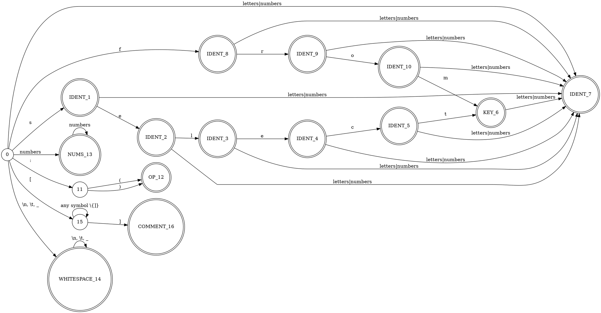

% Лабораторная работа № 1.4 «Лексический распознаватель»
% 3 апреля 2024 г.
% Ольга Александрова, ИУ9-61Б

# Цель работы
Целью данной работы является изучение использования детерминированных конечных автоматов 
с размеченными заключительными состояниями (лексических распознавателей) для решения задачи
лексического анализа.


# Индивидуальный вариант
select, from, :), :(, комментарии ограничены знаками [ и ], не могут пересекать границы строк текста.


# Реализация

Лексическая структура языка — регулярные выражения для доменов:

* IDENT ::= \b[a-zA-Z][a-zA-Z0-9]*
* NUM_LIT ::= \d*
* KEY_WORDS ::= "select" | "from"
* OPERATIONS ::= ":)" | ":("
* COMMENT ::= \[[^[]]*\]
* WHITESPACE ::= [ ] | \\n | \r | \t

Граф детерминированного распознавателя:



Реализация распознавателя:

Файл `Position.py`:
```python
class Position:
    def __init__(self, text_or_p):
        if isinstance(text_or_p, str):
            self.text = text_or_p
            self.line = 1
            self.pos = 1
            self.index = 0
        else:
            p = text_or_p
            self.text = p.getText()
            self.line = p.getLine()
            self.pos = p.getPos()
            self.index = p.getIndex()

    def getText(self):
        return self.text

    def getLine(self):
        return self.line

    def getPos(self):
        return self.pos

    def getIndex(self):
        return self.index

    def isEOF(self):
        return self.index == len(self.text)

    def getCode(self):
        return -1 if self.isEOF() else ord(self.text[self.index])

    def isWhitespace(self):
        return (not self.isEOF()) and (self.text[self.index].isspace())

    def isDecimalDigit(self):
        return (not self.isEOF()) and (self.text[self.index].isdigit())

    def isLetter(self):
        return not self.isEOF() and self.text[self.index].isalpha()

    def isSpecialSymbol(self):
        special_symbols = [':', '(', '\'', ')', '[', ']']
        return self.getCode() in map(ord, special_symbols)

    def isUnknown(self):
        return not self.isEOF() and not self.isNewLine() and not self.isDecimalDigit() and 
                  not self.isLetter() and not self.isWhitespace() and not self.isSpecialSymbol()

    def isNewLine(self):
        if self.index == len(self.text):
            return True
        if self.text[self.index] == '\r' and self.index + 1 < len(self.text):
            return self.text[self.index + 1] == '\n'
        return self.text[self.index] == '\n'

    def next(self):
        p = Position(self)
        if not p.isEOF():
            if p.isNewLine():
                p.line += 1
                p.pos = 1
            else:
                if 0xD800 <= ord(p.text[p.index]) <= 0xDBFF:
                    p.index += 1
                p.pos += 1
            p.index += 1
        return p

    def compareTo(self, other):
        return self.index - other.index

    def __str__(self):
        return f"({self.line}, {self.pos})"
```

Файл `Token.py`:
```python
class Token:
    def __init__(self, s1, s2, fragment):
        self.domain = s1
        self.attribute = s2
        self.fragment = fragment

    def getDomain(self):
        return self.domain

    def getAttribute(self):
        return self.attribute

    def __str__(self):
        return f"{self.domain} {self.fragment}: {self.attribute}"
```

Файл `Fragment.py`
```python
class Fragment:
    def __init__(self, starting, following):
        self.starting = starting
        self.following = following

    def getStarting(self):
        return self.starting

    def __str__(self):
        return f"{self.starting} - {self.following}"
```

Файл `Scanner.py`:

```python
class Scanner:
    table = [
      #  s    e   l   c    t    f    r    o    m    [     ]    :    )   (     a-z    num   \n     ws
        [1,   7,  7,  7,   7,   8,   7,   7,   7,   15,  -1,  11,  -1,   -1,   7,    13,    14,   14, -1],#0
        [7, 2, 7, 7, 7, 7, 7, 7, 7, -1, -1, -1, -1, -1, 7, 7, -1, -1, -1],#1
        [7, 7, 3, 7, 7, 7, 7, 7, 7, -1, -1, -1, -1, -1, 7, 7, -1, -1, -1],#2
        [7, 4, 7, 7, 7, 7, 7, 7, 7, -1, -1, -1, -1, -1, 7, 7, -1, -1, -1],#3
        [7, 7, 7, 5, 7, 7, 7, 7, 7, -1, -1, -1, -1, -1, 7, 7, -1, -1, -1],#4
        [7, 7, 7, 7, 6, 7, 7, 7, 7, -1, -1, -1, -1, -1, 7, 7, -1, -1, -1],#5
        [7, 7, 7, 7, 7, 7, 7, 7, 7, -1, -1, -1, -1, -1, 7, 7, -1, -1, -1],#6
        [7, 7, 7, 7, 7, 7, 7, 7, 7, -1, -1, -1, -1, -1, 7, 7, -1, -1, -1],#7
        [7, 7, 7, 7, 7, 7, 9, 7, 7, -1, -1, -1, -1, -1, 7, 7, -1, -1, -1],#8
        [7, 7, 7, 7, 7, 7, 7, 10, 7, -1, -1, -1, -1, -1, 7, 7, -1, -1, -1],#9
        [7, 7, 7, 7, 7, 7, 7, 7, 6, -1, -1, -1, -1, -1, 7, 7, -1, -1, -1],#10
        [-1, -1, -1, -1, -1, -1, -1, -1, -1, -1, -1, -1, 12, 12, -1, -1, -1, -1, -1],  # 11
        [-1, -1, -1, -1, -1, -1, -1, -1, -1, -1, -1, -1, -1, -1, -1, -1, -1, -1, -1],#12
        [-1, -1, -1, -1, -1, -1, -1, -1, -1, -1, -1, -1, -1, -1, -1, 13, -1, -1, -1], #13
        [-1, -1, -1, -1, -1, -1, -1, -1, -1, -1, -1, -1, -1, -1, -1, -1, 14, 14, -1], #14
        [15, 15, 15, 15, 15, 15, 15, 15, 15, 15, 16, 15, 15, 15, 15, 15, -1, 15, 15],#15
        [-1, -1, -1, -1, -1, -1, -1, -1, -1, -1, -1, -1, -1, -1, -1, -1, -1, -1, -1], #16
    ]

    def __init__(self, program):
        self.program = program
        self.pos = Position(program)
        self.state = 0
        self.messages = {}
        self.tokens = []

    def getState(self, state):
        if state in [1, 2, 3, 4, 5, 8, 7, 9, 10]:
            return "IDENT"
        if state == 6:
            return "KEY_WORD"
        if state == 12:
            return "OPERATIONS"
        if state == 13:
            return "NUM_LIT"
        if state == 16:
            return "COMMENTS"
        return "Error"
    
    def getCode(self, c):
        if c == 's':
            return 1
        if c == 'e':
            return 2
        if c == 'l':
            return 3
        if c == 'c':
            return 4
        if c == 't':
            return 5
        if c == 'f':
            return 6
        if c == 'r':
            return 7
        if c == 'o':
            return 8
        if c == 'm':
            return 9
        if c == '[':
            return 10
        if c == ']':
            return 11
        if c == ':':
            return 12
        if c == '(':
            return 13
        if c == ')':
            return 14
        if ('a' <= c <= 'z') or ('A' <= c <= 'Z'):
            return 15
        if '0' <= c <= '9':
            return 16
        if c == '\n':
            return 17
        if c in [' ',  '\t']:
            return 18
        return 19

    def run(self):
        while not self.pos.isEOF():
            word = ""
            self.state = 0
            final_state = False
            error_state = False
            start = Position(self.pos)

            while not self.pos.isEOF():
                curr_char = self.program[self.pos.getIndex()]
                jump_code = self.getCode(curr_char) - 1

                next_state = self.table[self.state][jump_code]

                if next_state == -1:
                    if self.state == 0:
                        error_state = True
                    else:
                        final_state = True
                    break

                word += curr_char
                self.state = next_state
                self.pos = self.pos.next()

                if self.pos.isEOF():
                    final_state = True
                    break

            if final_state:
                frag = Fragment(start, self.pos)
                self.tokens.append(Token(self.getState(self.state), word.replace("\n", " "), frag))
                continue

            if error_state:
                self.messages[self.pos] = "Unexpected characters"

            self.pos = self.pos.next()

        frag = Fragment(self.pos, self.pos)
        self.tokens.append(Token("END_OF_PROGRAM", "", frag))

    def hasNextToken(self):
        return bool(self.tokens)

    def nextToken(self):
        return self.tokens.pop(0)

    def output_messages(self):
        print("\nMessages:")
        for position, value in self.messages.items():
            print("ERROR", end=" ")
            print(f"({position.getLine()}, {position.getPos()}): {value}")
```

…

# Тестирование

Входные данные

```
     :)  [scfds ds] [!@#$%^&*(]
  from select 123 def23 23ddf () ::
```

Вывод на `stdout`

```
OPERATIONS (1, 6) - (1, 8): :)
COMMENTS (1, 10) - (1, 20): [scfds ds]
COMMENTS (1, 21) - (1, 32): [!@#$%^&*(]
KEY_WORD (2, 3) - (2, 7): from
KEY_WORD (2, 8) - (2, 14): select
NUM_LIT (2, 15) - (2, 18): 123
IDENT (2, 19) - (2, 24): def23
NUM_LIT (2, 25) - (2, 27): 23
Error (2, 30) - (2, 31):  
Error (2, 34) - (2, 35): :
END_OF_PROGRAM (2, 36) - (2, 36): 

Messages:
ERROR (2, 31): Unexpected characters
ERROR (2, 32): Unexpected characters
```

# Вывод

В ходе лабораторной работы  были изучены  детерминированные конечные
автоматы с размеченными заключительными состояниями (лексических распознавателей) 
для решения задачи лексического анализа. Был реализован ДКА и написана таблица переходов для него.
 